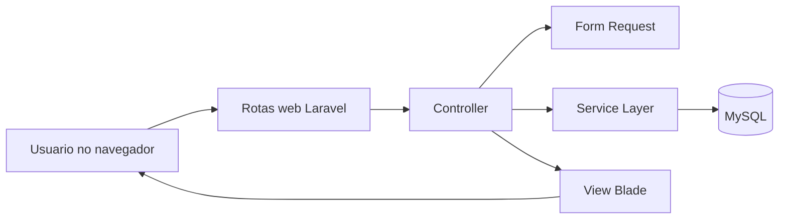
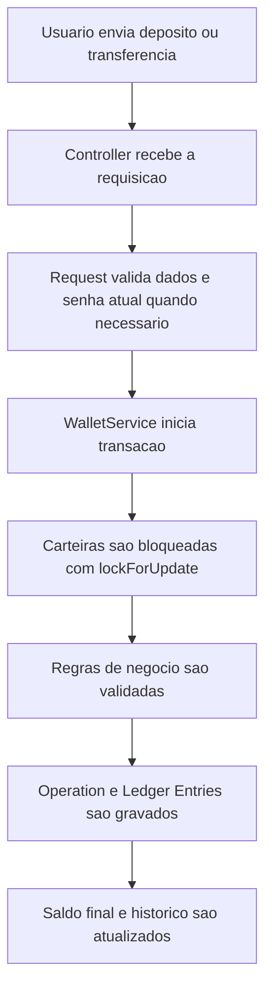

# Legion Bankin

Aplicação web em Laravel que simula uma carteira financeira digital. O sistema permite cadastro, autenticação, depósito, transferência entre contas, histórico de operações, reversão de operações, gerenciamento de amizades entre usuários e controle de status da conta.

O projeto foi construído para rodar em Docker, com interface server-side em Blade e regras financeiras centralizadas em uma camada de serviço para manter consistência transacional.

## Sumário

- Visão geral
- Stack e tecnologias aplicadas
- Arquitetura e decisões técnicas
- Funcionalidades do sistema
- Regras importantes do domínio
- Pré-requisitos
- Como clonar e subir o projeto do zero
- Como acessar o sistema
- Credenciais de demonstração
- Estrutura do projeto
- Estrutura atual do banco de dados
- Diagrama ER e fluxo da aplicação
- Telas principais e fluxo de uso
- Endpoints PHP usados
- Testes
- Troubleshooting
- Observações finais

## Visão geral

O Legion Bankin implementa um fluxo completo de carteira digital com os seguintes objetivos principais:

- cadastro e autenticação de usuários
- criação automática de carteira por usuário
- depósito de saldo
- transferência entre contas
- reversão de operações elegíveis
- histórico detalhado das movimentações
- gerenciamento de amizades para facilitar transferências
- ativação, inativação e exclusão lógica de contas

O sistema foi desenhado para manter rastreabilidade das movimentações por meio de operações e lançamentos contábeis, evitando alteração direta de saldo fora da camada de domínio.

## Stack e tecnologias aplicadas

### Backend

- PHP 8.4
- Laravel 13
- Eloquent ORM
- PHPUnit 12 para testes

### Banco de dados

- MySQL 8.4

### Frontend

- Blade
- Bootstrap 5
- JavaScript com jQuery
- Select2
- CSS customizado em arquivos estáticos dentro de public/css

### Infraestrutura e ambiente

- Docker
- Docker Compose
- Nginx
- PHP-FPM

### Apoio ao desenvolvimento

- Composer
- Laravel Pint
- Laravel Pail

## Arquitetura e decisões técnicas

O projeto usa uma arquitetura MVC com algumas separações adicionais para manter as regras de negócio mais claras.

### Camadas principais

- Controllers: recebem requisições HTTP e coordenam o fluxo da aplicação
- Form Requests: concentram validações de entrada
- Services: concentram regras de negócio mais sensíveis, especialmente as financeiras
- Models: representam entidades e relações do domínio
- Middleware: bloqueiam ações quando a conta não pode movimentar
- Views Blade: renderizam a interface do sistema

### Decisões técnicas relevantes

- Toda alteração de saldo passa por App\Services\WalletService.
- Transferências e reversões usam transações de banco com lockForUpdate para reduzir risco de inconsistências concorrentes.
- O saldo da carteira é auditável por meio da tabela de operações e da tabela de lançamentos contábeis.
- A reversão não altera a operação original diretamente em termos contábeis; ela cria uma nova operação do tipo reversal.
- O status da conta é persistido na carteira com os campos opt_active e opt_deleted.
- A exclusão da conta é lógica, sem remoção física de registros.

### Padrões e princípios aplicados

- Service Layer para regras financeiras
- Request Validation para entrada de dados
- Middleware para regras transversais de acesso
- Exceções de domínio para erros de negócio
- Separação de responsabilidades entre HTTP, domínio e persistência

## Funcionalidades do sistema

Atualmente o sistema possui as seguintes funcionalidades:

- cadastro de usuário
- login por e-mail ou número da conta
- logout
- criação automática de carteira no cadastro
- depósito de valores
- transferência para amigo
- transferência por número da conta
- validação de saldo antes da transferência
- bloqueio de transferência para contas inexistentes, inativas ou deletadas
- histórico de operações com paginação
- filtros de histórico por destinatário, tipo, status e período
- reversão de operação elegível
- bloqueio de reversão quando a operação envolve conta inativa ou deletada
- envio de solicitação de amizade
- aceite de amizade
- recusa de amizade
- cancelamento de solicitação enviada
- remoção de amizade aceita
- busca de novos amigos por nome, e-mail ou número da conta
- ocultação de contas inativas ou deletadas na busca de amizades
- visualização e edição de perfil
- alteração de nome e e-mail com confirmação por senha
- alteração de senha com confirmação por senha
- ativação e inativação da conta no perfil
- exclusão lógica da conta com exigência de saldo zerado
- bloqueio de login para conta deletada
- bloqueio de operações mutáveis quando a conta está inativa ou deletada

## Regras importantes do domínio

- Cada usuário possui uma única carteira.
- O número da conta exibido ao usuário é derivado do id da carteira com preenchimento à esquerda.
- Depósitos sempre somam ao saldo atual da carteira, inclusive se ela estiver negativa.
- Transferências só acontecem se a conta de origem tiver saldo suficiente.
- Transferências para a própria conta não são permitidas.
- Transferências para contas inativas ou deletadas não são permitidas.
- Reversões só são permitidas para operações concluídas e ainda reversíveis.
- Se a conta envolvida na reversão estiver inativa ou deletada, a reversão é bloqueada.
- A exclusão da conta é lógica: a carteira permanece no banco com opt_deleted igual a true e opt_active igual a false.
- Uma conta deletada não pode autenticar novamente até uma reativação administrativa.

## Pré-requisitos

Para rodar o projeto do zero, o ideal é que a máquina tenha:

- Git instalado
- Docker instalado
- Docker Compose disponível pelo comando docker compose
- Portas 8080 e 3306 livres

Você não precisa ter PHP, Composer, Node.js ou MySQL instalados localmente para subir a aplicação pelo fluxo principal descrito aqui, porque a execução do backend e do banco acontece via containers.

## Como clonar e subir o projeto do zero

### 1. Clonar o repositório

Abra um terminal e execute:

```bash
git clone https://github.com/clayveralves/legion_bankin.git
cd legion_bankin
```

### 2. Criar o arquivo de ambiente

Copie o arquivo de exemplo:

```bash
cp .env.example .env
```

O arquivo padrão já está preparado para o ambiente Docker deste projeto. Os pontos mais importantes são:

- APP_URL=http://localhost:8080
- DB_HOST=db
- DB_PORT=3306
- DB_DATABASE=legion_bankin
- DB_USERNAME=legion
- DB_PASSWORD=legion

### 3. Subir os containers

Execute:

```bash
docker compose up -d --build
```

Esse comando sobe os serviços:

- app: container PHP-FPM da aplicação Laravel
- web: container Nginx exposto em http://localhost:8080
- db: container MySQL 8.4

### 4. Instalar dependências PHP

Como o container da aplicação já possui o Composer, instale as dependências dentro dele:

```bash
docker compose exec app composer install
```

### 5. Gerar a chave da aplicação

```bash
docker compose exec app php artisan key:generate
```

### 6. Rodar as migrations

```bash
docker compose exec app php artisan migrate
```

### 7. Popular dados de demonstração

Para deixar o sistema funcional com usuários de exemplo e saldo inicial, execute:

```bash
docker compose exec app php artisan db:seed
```

Esse seed cria usuários de demonstração e adiciona saldo inicial quando necessário.

### 8. Validar se a aplicação está pronta

Se quiser validar rapidamente o projeto após subir tudo:

```bash
docker compose exec app php artisan test
```

### 9. Acessar o sistema

Com tudo acima concluído, acesse no navegador:

```text
http://localhost:8080
```

Nesse ponto o sistema já deve estar 100% funcional para uso local.

## Como acessar o sistema

### Opção 1: usar usuários de demonstração

Se você executou o seed, já pode entrar com um dos usuários abaixo.

### Opção 2: criar uma conta nova

- abra http://localhost:8080
- clique em Abrir conta
- faça o cadastro
- o sistema criará automaticamente a carteira do usuário

## Credenciais de demonstração

Se o comando de seed foi executado, os seguintes usuários são criados:

- ana@legionbankin.test
- bruno@legionbankin.test

Senha padrão dos usuários de demonstração:

```text
Password123
```

Cada um recebe saldo inicial de demonstração quando ainda não possui saldo.

## Estrutura do projeto

Resumo da estrutura principal:

```text
legion_bankin/
├── app/
│   ├── Enums/
│   ├── Exceptions/
│   ├── Http/
│   │   ├── Controllers/
│   │   ├── Middleware/
│   │   └── Requests/
│   ├── Models/
│   └── Services/
├── bootstrap/
├── config/
├── database/
│   ├── factories/
│   ├── migrations/
│   └── seeders/
├── docker/
├── public/
│   ├── css/
│   └── js/
├── resources/
│   └── views/
├── routes/
├── storage/
├── tests/
│   ├── Feature/
│   └── Unit/
├── docker-compose.yml
├── Dockerfile
├── composer.json
├── package.json
└── README.md
```

### Pastas mais importantes

- app/Services: regras financeiras e de domínio
- app/Http/Controllers: entrada HTTP e coordenação dos fluxos
- app/Http/Requests: validações das operações
- app/Models: entidades e relacionamentos
- database/migrations: estrutura do banco
- database/seeders: dados de demonstração
- resources/views: interface Blade
- public/css e public/js: assets estáticos da aplicação
- tests/Feature: testes de integração do sistema

## Estrutura atual do banco de dados

### users

Tabela padrão de usuários autenticáveis.

Campos principais:

- id
- name
- email
- password
- email_verified_at
- remember_token
- created_at
- updated_at

### wallets

Representa a carteira principal de cada usuário.

Campos principais:

- id
- user_id
- balance
- opt_active
- opt_deleted
- created_at
- updated_at

Observações:

- user_id é único, garantindo uma carteira por usuário
- opt_active controla se a conta pode movimentar saldo
- opt_deleted controla a exclusão lógica da conta

### operations

Representa a operação de negócio registrada no sistema.

Campos principais:

- id
- uuid
- type
- status
- initiator_id
- description
- reversal_of_id
- reversed_at
- reversal_reason
- created_at
- updated_at

Tipos de operação usados atualmente:

- deposit
- transfer
- reversal

Status usados atualmente:

- completed
- reversed

### ledger_entries

Representa os lançamentos contábeis gerados por cada operação.

Campos principais:

- id
- operation_id
- wallet_id
- direction
- amount
- balance_before
- balance_after
- created_at

Observações:

- cada operação pode gerar múltiplos lançamentos
- os lançamentos permitem rastrear a evolução do saldo por carteira

### friendships

Representa solicitações e vínculos de amizade entre usuários.

Campos principais:

- id
- requester_id
- addressee_id
- status
- responded_at
- created_at
- updated_at

Status usados atualmente:

- pending
- accepted
- declined

### Tabelas auxiliares do Laravel

Também existem tabelas padrão do framework para suporte ao sistema:

- sessions
- password_reset_tokens
- cache
- jobs

## Diagrama ER e fluxo da aplicação

### Diagrama entidade relacionamento

```mermaid
erDiagram
	USERS ||--|| WALLETS : possui
	USERS ||--o{ OPERATIONS : inicia
	OPERATIONS ||--o{ LEDGER_ENTRIES : gera
	WALLETS ||--o{ LEDGER_ENTRIES : recebe
	OPERATIONS ||--o| OPERATIONS : reverte
	USERS ||--o{ FRIENDSHIPS : requester_id
	USERS ||--o{ FRIENDSHIPS : addressee_id

	USERS {
		bigint id PK
		string name
		string email UK
		string password
		timestamps timestamps
	}

	WALLETS {
		bigint id PK
		bigint user_id FK UK
		decimal balance
		boolean opt_active
		boolean opt_deleted
		timestamps timestamps
	}

	OPERATIONS {
		bigint id PK
		uuid uuid UK
		string type
		string status
		bigint initiator_id FK
		string description
		bigint reversal_of_id FK
		timestamp reversed_at
		string reversal_reason
		timestamps timestamps
	}

	LEDGER_ENTRIES {
		bigint id PK
		bigint operation_id FK
		bigint wallet_id FK
		string direction
		decimal amount
		decimal balance_before
		decimal balance_after
		timestamp created_at
	}

	FRIENDSHIPS {
		bigint id PK
		bigint requester_id FK
		bigint addressee_id FK
		string status
		timestamp responded_at
		timestamps timestamps
	}
```

### Fluxo arquitetural resumido



### Fluxo financeiro resumido



## Telas principais e fluxo de uso

Esta seção descreve as telas principais para facilitar entendimento funcional do sistema e servir como guia para futuras capturas de tela no repositório.

### Tela inicial

Ao acessar a aplicação, o usuário encontra:

- apresentação do produto como banco digital
- botão para abrir conta
- botão para acessar conta existente
- cards com destaques de transferências, segurança e histórico

### Tela de cadastro

Na abertura de conta, o usuário informa:

- nome
- e-mail
- senha
- confirmação de senha

Ao concluir o cadastro:

- a conta do usuário é criada
- a carteira é gerada automaticamente
- a sessão é iniciada
- o usuário é redirecionado ao dashboard

### Tela de login

Na autenticação, o usuário pode entrar com:

- e-mail
- número da conta formatado

O sistema também bloqueia login de conta deletada.

### Dashboard

O dashboard concentra as operações principais:

- saldo atual da carteira
- identificação da conta
- formulário de depósito
- formulário de transferência
- gerenciamento de amizades
- histórico de operações
- modal Minha conta para perfil e status da conta

### Modal Minha conta

No modal de perfil, o usuário pode:

- visualizar nome, e-mail, número da conta e status
- alterar dados cadastrais
- alterar senha
- ativar ou inativar a conta
- excluir logicamente a conta se o saldo estiver zerado

### Fluxo de uso passo a passo

#### Fluxo 1: primeira execução usando usuário novo

1. Suba o ambiente Docker.
2. Acesse a página inicial.
3. Clique em Abrir conta.
4. Preencha nome, e-mail e senha.
5. Finalize o cadastro.
6. Entre no dashboard.
7. Faça um depósito.
8. Localize outro usuário por amizade ou número da conta.
9. Realize uma transferência.
10. Consulte o histórico gerado.

#### Fluxo 2: primeira execução usando seed de demonstração

1. Rode as migrations.
2. Rode o seed.
3. Acesse a página de login.
4. Use uma credencial de demonstração.
5. Consulte saldo, histórico e recursos de transferência.

#### Fluxo 3: gerenciamento da conta

1. No dashboard, clique em Minha conta.
2. Altere informações ou senha se desejar.
3. Use Alterar status para ativar ou inativar a conta.
4. Se o saldo estiver zerado, use Excluir conta para exclusão lógica.

### Sugestão de capturas de tela para documentação futura

Se você quiser evoluir a documentação visual com imagens reais, as capturas mais úteis são:

- home com os botões Abrir conta e Acessar conta
- tela de cadastro preenchida
- tela de login
- dashboard com saldo, depósito, transferência e histórico
- modal Minha conta aberto
- fluxo de exclusão lógica da conta

## Endpoints PHP usados

O projeto não expõe uma API REST separada; os endpoints principais são rotas web do Laravel.

### Públicas

| Método | Endpoint | Finalidade |
|---|---|---|
| GET | / | Página inicial |
| GET | /register | Tela de cadastro |
| POST | /register | Criação de conta |
| GET | /login | Tela de login |
| POST | /login | Autenticação por e-mail ou número da conta |

### Autenticadas

| Método | Endpoint | Finalidade |
|---|---|---|
| GET | /dashboard | Painel principal |
| PATCH | /profile | Atualização de perfil |
| DELETE | /profile | Exclusão lógica da conta |
| GET | /accounts/lookup | Busca de conta para transferência |
| POST | /logout | Encerramento da sessão |

### Autenticadas e com conta ativa

| Método | Endpoint | Finalidade |
|---|---|---|
| POST | /friendships | Envio de amizade |
| PATCH | /friendships/{friendship} | Aceite ou recusa de amizade |
| DELETE | /friendships/{friendship} | Cancelamento ou remoção de amizade |
| POST | /deposit | Depósito |
| POST | /transfer | Transferência |
| POST | /operations/{operation}/reverse | Reversão de operação |

## Testes

O projeto possui principalmente testes de integração em Feature.

Arquivos principais de teste:

- tests/Feature/AuthTest.php
- tests/Feature/WalletOperationsTest.php
- tests/Feature/FriendshipTest.php
- tests/Feature/ProfileTest.php

Para executar todos os testes:

```bash
docker compose exec app php artisan test
```

Para executar apenas um arquivo específico:

```bash
docker compose exec app php artisan test tests/Feature/WalletOperationsTest.php
```

## Troubleshooting

### A porta 8080 já está em uso

Sintoma:

- o container web sobe com erro de bind
- o navegador não abre a aplicação em localhost:8080

Como resolver:

- pare o processo que está usando a porta 8080
- ou altere a porta mapeada em docker-compose.yml

Exemplo:

```yaml
ports:
	- "8081:80"
```

Depois acesse em http://localhost:8081.

### A porta 3306 já está em uso

Sintoma:

- o container do MySQL não sobe

Como resolver:

- pare o MySQL local que estiver usando a porta
- ou altere o mapeamento da porta no serviço db em docker-compose.yml

### O comando docker compose não existe

Sintoma:

- erro informando comando não encontrado

Como resolver:

- instale Docker Desktop ou Docker Engine com Compose habilitado
- valide com:

```bash
docker --version
docker compose version
```

### Erro ao conectar no banco durante migrate

Sintoma:

- php artisan migrate falha por conexão recusada ou host indisponível

Como resolver:

- confirme se o container db está em execução
- aguarde o healthcheck do MySQL terminar
- verifique se o .env está com DB_HOST=db

Comandos úteis:

```bash
docker compose ps
docker compose logs db
```

### A aplicação sobe, mas aparece erro 500

Sintoma:

- a página abre com erro interno do servidor

Como resolver:

- confirme se o .env existe
- gere a APP_KEY
- instale as dependências do Composer
- rode migrations
- confira os logs da aplicação

Comandos úteis:

```bash
docker compose exec app composer install
docker compose exec app php artisan key:generate
docker compose exec app php artisan migrate
docker compose logs app
```

### A aplicação abre sem CSS ou JS esperado

Sintoma:

- a interface abre sem aparência correta

Como resolver:

- confirme se os arquivos em public/css e public/js existem
- recarregue o navegador sem cache
- verifique se o Nginx está servindo a pasta public corretamente

### Quero reiniciar tudo do zero

Para derrubar os containers:

```bash
docker compose down
```

Para derrubar containers e apagar o volume do banco:

```bash
docker compose down -v
```

Para recriar banco e dados de demonstração:

```bash
docker compose up -d --build
docker compose exec app composer install
docker compose exec app php artisan key:generate
docker compose exec app php artisan migrate:fresh --seed
```

## Observações finais

- O projeto já inclui Dockerfile e docker-compose.yml para facilitar avaliação e execução local.
- Os assets principais usados pela aplicação estão em public/css e public/js, então o sistema consegue funcionar localmente sem depender de build frontend para o fluxo principal documentado aqui.
- O package.json permanece no projeto como suporte ao ecossistema Laravel e a um fluxo opcional de frontend, mas não é obrigatório para subir o ambiente descrito neste README.
- Se você quiser resetar o banco local durante o desenvolvimento, pode usar:

```bash
docker compose exec app php artisan migrate:fresh --seed
```

- Se quiser parar os containers:

```bash
docker compose down
```

- Se quiser remover também o volume do MySQL e começar totalmente do zero:

```bash
docker compose down -v
```
